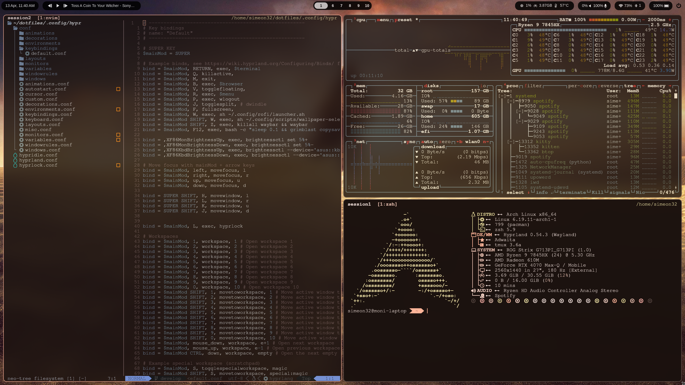
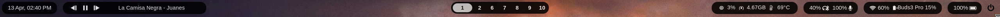
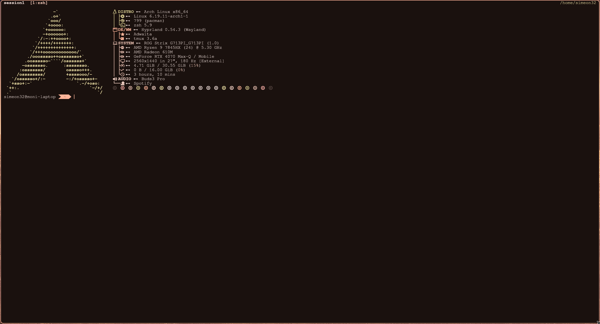
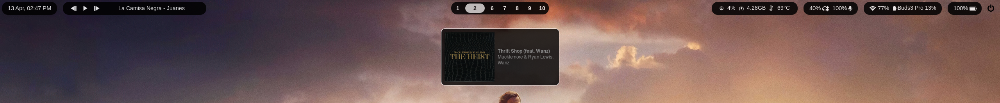
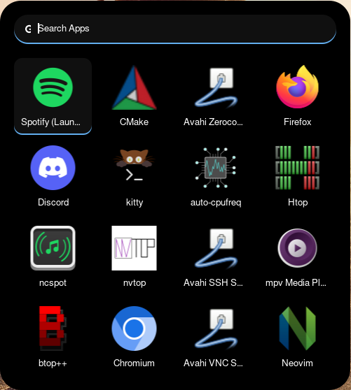
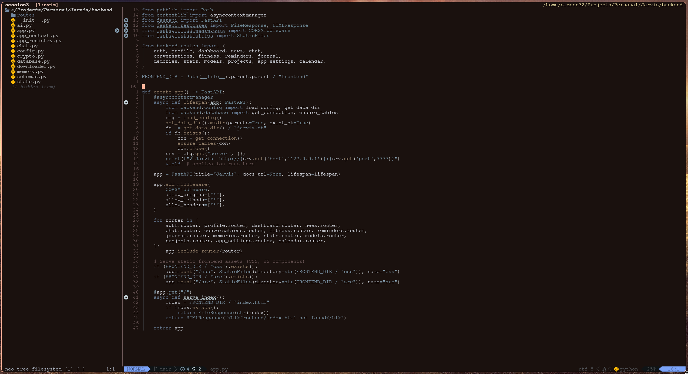

<div align="center">

<br>

```
  ██████╗  ██████╗ ████████╗███████╗██╗██╗     ███████╗███████╗
  ██╔══██╗██╔═══██╗╚══██╔══╝██╔════╝██║██║     ██╔════╝██╔════╝
  ██║  ██║██║   ██║   ██║   █████╗  ██║██║     █████╗  ███████╗
  ██║  ██║██║   ██║   ██║   ██╔══╝  ██║██║     ██╔══╝  ╚════██║
  ██████╔╝╚██████╔╝   ██║   ██║     ██║███████╗███████╗███████║
  ╚═════╝  ╚═════╝    ╚═╝   ╚═╝     ╚═╝╚══════╝╚══════╝╚══════╝
```

**My personal Arch Linux · Hyprland · Wayland configuration**

<br>


<br>


<br>

[](./screenshots/)
[](https://github.com/SimeonVutov/dotfiles/stargazers)
[](https://github.com/SimeonVutov/dotfiles/commits/master)

<br>

| [Features](#-features) | [Components](#-components) | [Screenshots](#-screenshots) | [Theme](#-theme--colors) | [Structure](#-repo-structure) | [Installation](#-installation) |
|:---:|:---:|:---:|:---:|:---:|:---:|

<br>

</div>

---

## 📸 Screenshots

<div align="center">

| Desktop | Workflow |
|---|---|
|  |  |

> 📂 More screenshots in [`./screenshots/`](./screenshots/)

</div>

---

## 🖥️ System Overview

| Component | Name |
|---|---|
| **OS** | Arch Linux |
| **Window Manager** | Hyprland (Wayland) |
| **Status Bar** | Waybar |
| **Terminal** | Kitty |
| **Shell** | Zsh + Oh My Zsh (agnoster) |
| **Editor** | Neovim (submodule) |
| **App Launcher** | Rofi |
| **Notifications** | Dunst |
| **File Manager** | Ranger |
| **Multiplexer** | Tmux |
| **Music** | ncspot (Spotify TUI) |
| **Media Player** | mpv |
| **Fetch** | Fastfetch |
| **Logout** | wlogout |
| **Theming** | pywal / wal |
| **Fonts** | Nerd Fonts |

---

## ⚡ Features

### 🔷 Hyprland

> `/.config/hypr/`

Hyprland is the core of this setup — a dynamic tiling Wayland compositor with buttery-smooth animations and extensive customization.

- **Tiling & Floating** — smart window tiling with flexible per-workspace layout rules
- **Animations** — custom bezier curves and animation presets for window open/close, workspace switching, and layer popups
- **Window Rules** — per-app floating, opacity, and workspace assignment rules
- **Input** — fine-tuned touchpad gestures, mouse sensitivity, and keyboard repeat rates
- **Monitors** — multi-monitor support with per-display resolution, refresh rate, and scaling
- **Keybinds** — a complete, logically grouped keybind system covering workspaces, windows, apps, media, and scripts
- **Hypridle / Hyprlock** — auto screen lock with configurable idle timeout
- **Environment Variables** — Wayland-native env vars for proper app compatibility (XDG, cursor, Qt/GTK backends)

---

### 🟦 Waybar

> `/.config/waybar/`

Custom status bar written in CSS with Python-powered modules.

<!--  -->
> 📸 *Screenshot — add to [`screenshots/waybar.png`](./screenshots/)*

- **Workspaces** — Hyprland workspace indicators with active/urgent/occupied states
- **Media Player** — live track info with playback controls (play/pause/skip), scroll to change volume
- **Clock** — styled clock with a calendar tooltip on hover
- **Network** — WiFi/ethernet status with SSID and signal strength
- **Bluetooth** — connection status with device name
- **Audio** — PulseAudio/PipeWire volume module with mute toggle and scroll-to-adjust
- **Battery** — percentage with charging indicator and power-state icons
- **CPU / Memory** — real-time usage with custom icons
- **Brightness** — backlight percentage with scroll support
- **System Tray** — app tray integration for background services
- **Custom Styling** — fully hand-written CSS with a coherent color palette across all modules

---

### 🐱 Kitty

> `/.config/kitty/`

GPU-accelerated terminal with a clean, distraction-free look.

<!--  -->
> 📸 *Screenshot — add to [`screenshots/kitty.png`](./screenshots/)*

- **Font** — Nerd Font with ligature support
- **Colors** — custom color scheme consistent with the overall pywal theme
- **Transparency / Blur** — background opacity with Hyprland blur layer rules
- **Padding** — comfortable inner padding for readability
- **Tab Bar** — styled tab bar with custom separators
- **Scrollback** — large scrollback buffer with fast search
- **URL Detection** — clickable URLs and file paths

---

### 🔔 Dunst

> `/.config/dunst/`

Lightweight notification daemon styled to match the rest of the setup.

<!--  -->
> 📸 *Screenshot — add to [`screenshots/dunst.png`](./screenshots/)*

- **Custom Geometry** — top-right position with defined size and offsets
- **Rounded Corners** — corner radius matching the Hyprland rounding value
- **Icon Support** — application icon displayed alongside notification text
- **Urgency Levels** — separate styles for low / normal / critical urgency
- **Timeouts** — per-urgency timeout configuration
- **pywal Integration** — colors pulled from wal templates for theme consistency
- **Dismiss Binds** — keyboard and mouse bindings to dismiss/close all

---

### 🚀 Rofi

> `/.config/rofi/`

App launcher, window switcher, and dmenu replacement with a custom theme.

<!--  -->
> 📸 *Screenshot — add to [`screenshots/rofi.png`](./screenshots/)*

- **Custom `.rasi` Theme** — hand-crafted layout with styled input bar, results list, and scrollbar
- **App Launcher** (`drun` mode) — fuzzy search across all installed desktop entries
- **Window Switcher** (`window` mode) — quickly jump between open windows
- **Script Menus** — integrated with custom shell scripts for power, wallpaper, and more
- **Icons** — Nerd Font / icon theme integration for app icons in the list
- **Consistent Palette** — colors match Waybar and Dunst for a unified look

---

### 📝 Neovim

> `/.config/nvim/` *(git submodule)*

Full Neovim configuration tracked as its own submodule for independent versioning.

<!--  -->
> 📸 *Screenshot — add to [`screenshots/nvim.png`](./screenshots/)*

- **Plugin Manager** — lazy.nvim for fast, on-demand plugin loading
- **LSP** — full Language Server Protocol support via nvim-lspconfig (C/C++, Python, Lua, JS, …)
- **Completion** — nvim-cmp with snippet support (LuaSnip)
- **Treesitter** — syntax highlighting and text objects via nvim-treesitter
- **Telescope** — fuzzy finder for files, buffers, grep, and LSP symbols
- **File Explorer** — NeoTree or Oil.nvim for file navigation
- **Git Integration** — Gitsigns for inline diff indicators and hunk navigation
- **Status Line** — custom Lualine with a theme matching the terminal colorscheme
- **Keymaps** — logical, leader-key-based keymap layout
- **C/C++ Support** — clangd LSP, debugger integration with nvim-dap and cgdb

---

### 🐚 Zsh + Oh My Zsh

> `.zshrc`

A highly productive shell environment built on Oh My Zsh with smart quality-of-life improvements.

- **Theme** — `agnoster` prompt showing git branch, status, and exit codes at a glance
- **Plugins** — `git`, `archlinux`, `zsh-autosuggestions` for inline history-based suggestions
- **Smart Tmux Auto-Attach** — on every new shell, automatically attaches to an existing idle tmux session or creates a new numbered one (`session1`, `session2`, …); prevents orphaned sessions
- **Fastfetch on Login** — system info displayed on every new terminal session
- **eza Aliases** — `ls`, `ll`, `lt` all use `eza` with icons for a beautiful file listing
- **FZF Integration** — `Ctrl+R` launches a fuzzy history search with full preview
- **power-mode Autocompletion** — custom Zsh completion function for the `power-mode` script with contextual options (`ultimate`, `balanced`, `-min`, `-max`, `-gov powersave/performance`)
- **Wayland Environment Refresh** — `precmd` hook re-exports `WAYLAND_DISPLAY`, `XDG_RUNTIME_DIR`, and friends into each tmux pane so GUI apps never lose their display connection
- **Developer Paths** — Raspberry Pi Pico SDK, Picotool, QuestaSim (FPGA/simulation), and pnpm all pre-configured in `$PATH`

---

### 🖥️ Tmux

> `/.config/tmux/`

Terminal multiplexer configured for a smooth, keyboard-driven multi-session workflow.

- **Status Bar** — custom styled status line matching the terminal theme
- **Session Naming** — automatic sequential session naming (`session1`, `session2`, …) managed by Zsh
- **Mouse Support** — optional mouse for pane resizing and selection
- **Vim-like Pane Navigation** — `hjkl` keybinds for moving between panes
- **Copy Mode** — vi-style copy mode with clipboard integration via `wl-clipboard`
- **Plugin Support** — managed via tpm (Tmux Plugin Manager)
- **Persistent Environment** — Wayland display variables refreshed per-pane automatically

---

### 🎨 pywal / wal

> `/.config/wal/templates/`

Automatic theming pipeline that generates a cohesive colorscheme from the current wallpaper and propagates it across the entire system.

- **Templates** — custom wal templates for Waybar CSS, Dunst, Kitty, Rofi, and more
- **Hot Reload** — changing wallpaper triggers a full theme refresh across all running applications
- **Color Consistency** — every UI element (bar, notifications, launcher, terminal) shares the same palette derived from the wallpaper

---

### ⚡ power-mode

> `/.config/power-mode/`

A custom CLI tool for managing CPU performance profiles on-the-fly — useful for switching between battery-saving and full-performance modes without touching system settings manually.

- **Presets** — `ultimate` (full power) and `balanced` (power saver) quick-apply modes
- **Fine-Grained Control** — `-min` / `-max` frequency bounds and `-gov` governor selection (`powersave` / `performance`)
- **TLP Integration** — coordinates with TLP (`/.config/tlp/`) for battery management policies
- **Zsh Completion** — full autocompletion with contextual hints registered via `compdef`

---

### 📂 Ranger

> `/.config/ranger/`

A terminal file manager with a Miller-column layout, previews, and custom key mappings.

- **Image Previews** — images rendered inline via Kitty's terminal graphics protocol
- **Custom Keymaps** — logical shortcuts for common operations
- **Devicons** — Nerd Font file icons for every file type
- **Plugin Support** — custom commands and bookmarks

---

### 🎵 ncspot

> `/.config/ncspot/`

A Rust-based terminal Spotify client with a minimal TUI interface.

- **Vim Keybinds** — `hjkl` navigation through the library
- **Custom Theme** — colors consistent with the rest of the terminal theme
- **Queue & Playlist Management** — browse, add, and reorder from the keyboard

---

### 🐞 GDB / cgdb

> `.gdbinit` + `/.config/cgdb/`

Developer-focused debugger configuration for C/C++ work.

- **Pretty Printers** — `.gdbinit` sets up `pwndbg` / GEF style pretty-printing for standard types
- **Auto-load** — safe `.gdbinit` auto-loading enabled for project-level configs
- **cgdb** — curses interface over GDB with a split source/assembly view

---

### 🛠️ Scripts

> `/.config/scripts/`

A collection of custom shell and Python scripts powering automated workflows.

- **Wallpaper Picker** — rofi-integrated wallpaper selector that triggers wal on selection
- **Screenshot** — `grim` + `slurp` integration for region/window/fullscreen captures
- **System Power Menu** — wlogout launcher with keybind integration
- **Waybar Reload** — script to hot-reload Waybar config and CSS without restarting
- **Media Control** — playerctl wrappers for media key handling

---

### 🔧 Systemd User Services

> `/.config/systemd/user/`

Custom systemd user-level services for daemons that should start with the session.

- **Auto-start** — services for background processes managed independently of the compositor
- **Logging** — journal-based logging for easy debugging

---

## 🎨 Theme & Colors

The colorscheme is dynamically generated by **pywal** from the current wallpaper. Every component — Waybar, Kitty, Dunst, Rofi, and Neovim — consumes the same generated palette, ensuring full visual consistency regardless of the wallpaper chosen.

**Fonts used across the setup:**
- **UI / Bar** — Nerd Font patched (icons + ligatures)
- **Terminal** — Nerd Font Mono
- **Editor** — Nerd Font Mono

<!--  -->

---

## 🗂️ Repo Structure

```
dotfiles/
├── .config/
│   ├── hypr/             # Hyprland WM — keybinds, animations, monitor config
│   ├── waybar/           # Status bar — config.jsonc + style.css + Python modules
│   ├── kitty/            # Terminal emulator config
│   ├── dunst/            # Notification daemon
│   ├── rofi/             # App launcher — .rasi theme
│   ├── nvim/             # Neovim (git submodule → own repo)
│   ├── tmux/             # Terminal multiplexer
│   ├── ranger/           # Terminal file manager
│   ├── fastfetch/        # System info fetch config
│   ├── ncspot/           # Spotify TUI client
│   ├── mpv/              # Media player config
│   ├── power-mode/       # Custom CPU power profile CLI
│   ├── tlp/              # Battery & power management
│   ├── wal/templates/    # pywal color templates
│   ├── scripts/          # Custom shell/Python scripts
│   ├── systemd/user/     # Systemd user services
│   ├── wlogout/          # Logout screen
│   ├── btop/             # Beautiful system monitor
│   ├── htop/             # Process viewer config
│   ├── cgdb/             # Curses GDB interface
│   └── glow/             # Markdown viewer
├── .zshrc                # Zsh config — Oh My Zsh, aliases, tmux logic
├── .gdbinit              # GDB pretty-printer and auto-load config
├── .oh-my-zsh/           # Oh My Zsh (git submodule)
└── screenshots/          # 📸 Desktop screenshots
```

---

## 🚀 Installation

> ⚠️ **An automated installation script is coming soon.**  
> In the meantime, configs can be manually symlinked or copied from `.config/` to `~/.config/`.

```bash
# Clone the repo
git clone --recurse-submodules https://github.com/SimeonVutov/dotfiles.git ~/dotfiles
```

*Manual symlinking of individual components is recommended until the install script is ready.*

---

## 📂 More Screenshots

> Browse the full screenshot gallery in [`./screenshots/`](./screenshots/)

---

<div align="center">

Made with ❤️ on Arch Linux

*If this helped you, consider leaving a ⭐*

</div>
