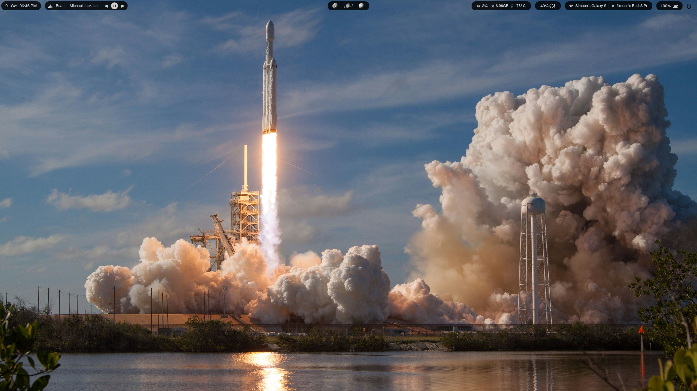
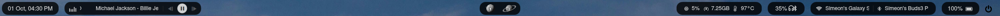
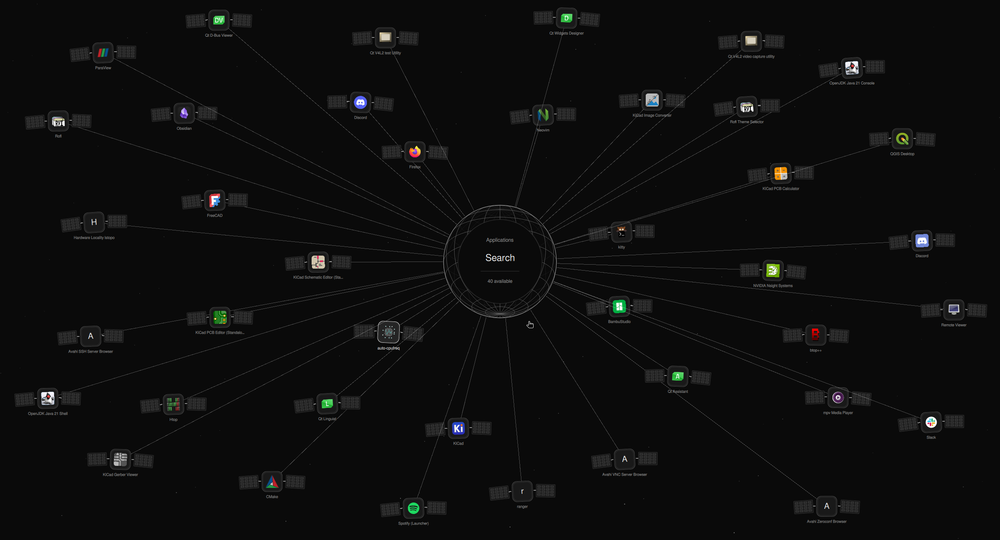
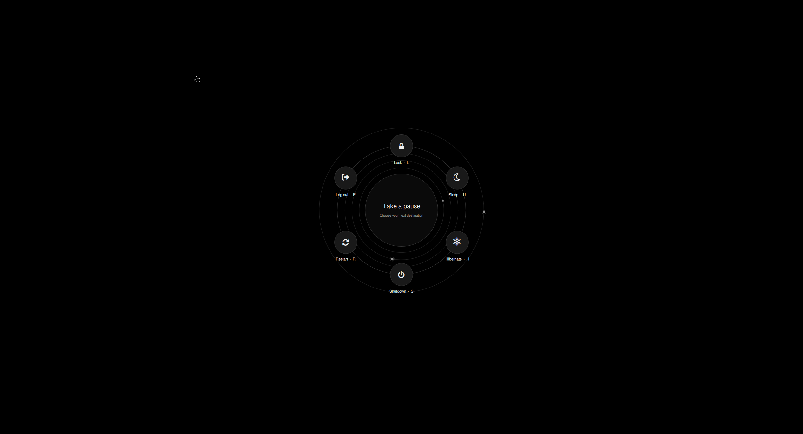
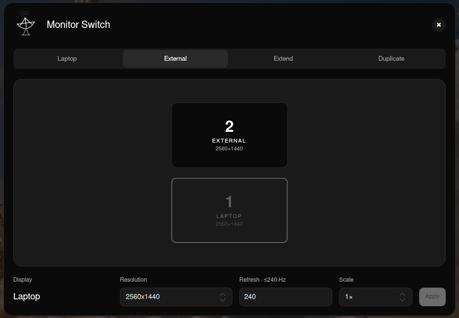
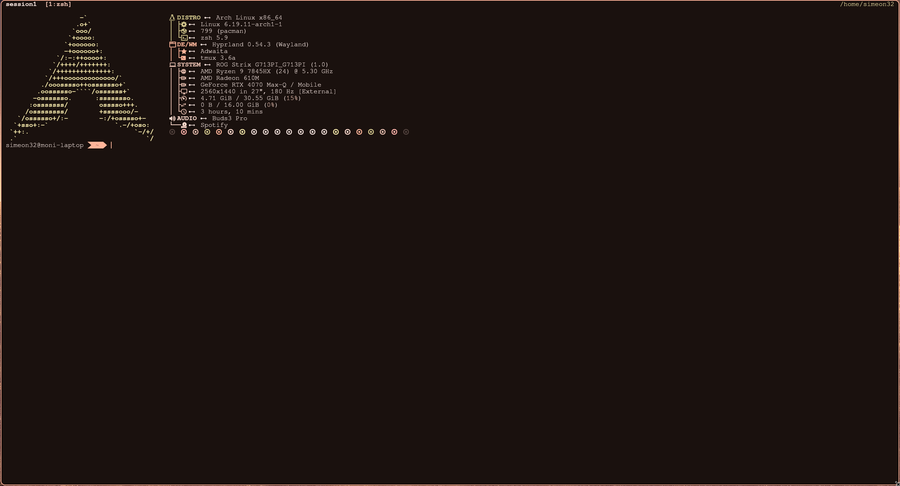
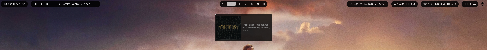
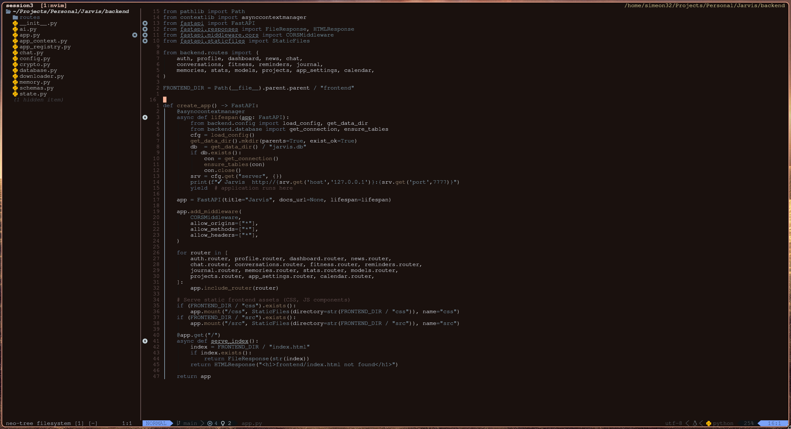
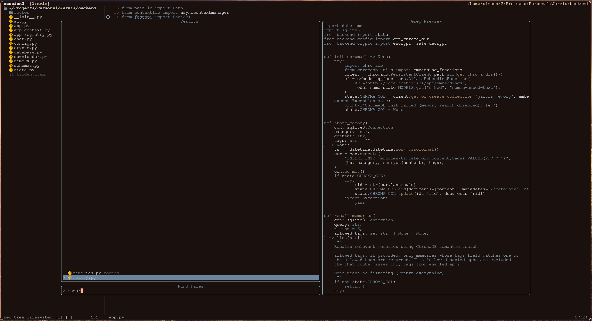
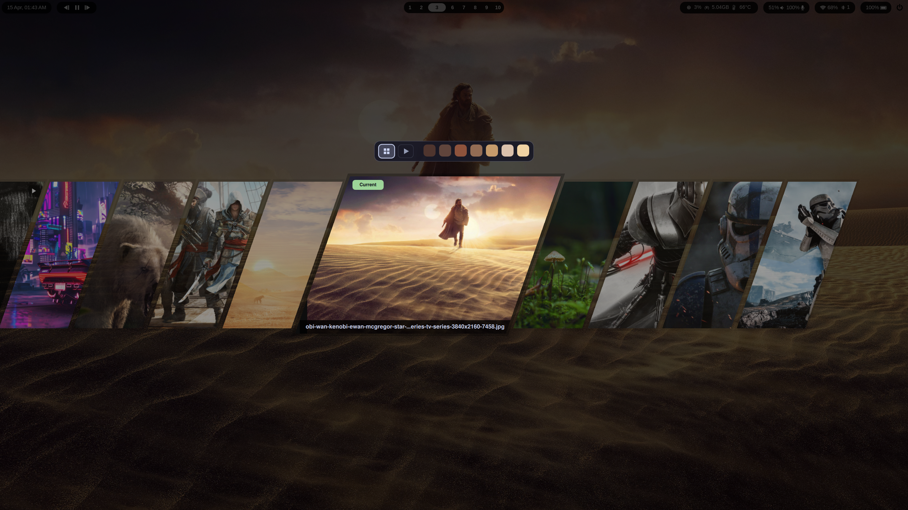

<div align="center">

<br>

<pre>
██████╗  ██████╗ ████████╗███████╗██╗██╗     ███████╗███████╗
██╔══██╗██╔═══██╗╚══██╔══╝██╔════╝██║██║     ██╔════╝██╔════╝
██║  ██║██║   ██║   ██║   █████╗  ██║██║     █████╗  ███████╗
██║  ██║██║   ██║   ██║   ██╔══╝  ██║██║     ██╔══╝  ╚════██║
██████╔╝╚██████╔╝   ██║   ██║     ██║███████╗███████╗███████║
╚═════╝  ╚═════╝    ╚═╝   ╚═╝     ╚═╝╚══════╝╚══════╝╚══════╝
</pre>

<br>

<b>My personal Arch Linux · Hyprland · Wayland configuration</b>

</div>

<br>


<br>



<br>

[](./screenshots/)
[](https://github.com/SimeonVutov/dotfiles/stargazers)
[](https://github.com/SimeonVutov/dotfiles/commits/master)

<br>

| [Features](#-features) | [Components](#-components) | [Screenshots](#-screenshots) | [Theme](#-theme--colors) | [Structure](#-repo-structure) | [Installation](#-installation) |
|:---:|:---:|:---:|:---:|:---:|:---:|

<br>

</div>

---

## 📸 Screenshots

See the [Quickshell interface](#-quickshell-desktop) below for the topbar, app launcher, session menu, and monitor switcher.

More screenshots are available in [`./screenshots/`](./screenshots/).

---

## 🖥️ System Overview

| Component | Name |
|---|---|
| **OS** | Arch Linux |
| **Window Manager** | Hyprland (Wayland) |
| **Status Bar** | Quickshell |
| **Terminal** | Kitty |
| **Shell** | Zsh + Oh My Zsh (agnoster) |
| **Editor** | Neovim (submodule) |
| **App Launcher** | Quickshell |
| **Notifications** | Dunst |
| **File Manager** | Ranger |
| **Multiplexer** | Tmux |
| **Music** | ncspot (Spotify TUI) |
| **Media Player** | mpv |
| **Fetch** | Fastfetch |
| **Session Menu** | Quickshell |
| **Theming** | Matugen |
| **Fonts** | Nerd Fonts |

---

## ⚡ Features

### 🔷 Hyprland

> `/.config/hypr/`

Hyprland is the core of this setup — a dynamic tiling Wayland compositor with buttery-smooth animations and extensive customization.

- **Tiling & Floating** — smart window tiling with flexible per-workspace layout rules
- **Animations** — custom bezier curves and animation presets for window open/close, workspace switching, and layer popups
- **Window Rules** — per-app floating, opacity, and workspace assignment rules
- **Input** — fine-tuned touchpad gestures, mouse sensitivity, and keyboard repeat rates
- **Monitors** — multi-monitor support with per-display resolution, refresh rate, and scaling
- **Keybinds** — a complete, logically grouped keybind system covering workspaces, windows, apps, media, and scripts
- **Hypridle / Hyprlock** — auto screen lock with configurable idle timeout
- **Environment Variables** — Wayland-native env vars for proper app compatibility (XDG, cursor, Qt/GTK backends)

---

### 🟦 Quickshell Desktop

> `/.config/quickshell/topbar/`

A custom desktop interface built with QML and Quickshell. A shared runtime powers the topbar and its overlays, with heavier panels loaded on demand.

#### Topbar



- **Orbital Workspaces** — procedural planets represent active workspaces, with an orbiting spacecraft and animated transfers between them
- **Adaptive Views** — components compress according to configurable priorities as space becomes limited; right-click a component to select views that persist across restarts
- **Media** — track information and playback controls, with compact views for smaller displays
- **Audio and Connectivity** — output/input volume, audio devices and profiles, WiFi, and Bluetooth controls in expandable panels
- **Hardware and Battery** — CPU usage, memory, temperature, and battery status, with sampling tailored to visible hardware metrics
- **Clock and Calendar** — date and time with an expandable calendar

#### App Launcher

A satellite-inspired interface arranges applications around a central search console. Open it with `Super + W`.



#### Session Menu

An animated orbital menu provides lock, logout, sleep, hibernate, restart, and shutdown actions. Open it with `Super + P`.



#### Monitor Switcher

Switch between laptop, external, extended, and duplicated displays. Adjust display placement, resolution, refresh rate, and scale through a visual layout editor. Changes use a confirmation timer and automatically revert if they are not confirmed.



---

### 🐱 Kitty

> `/.config/kitty/`

GPU-accelerated terminal with a clean, distraction-free look.



- **Font** — Nerd Font with ligature support
- **Colors** — dynamic color scheme generated by Matugen from the current wallpaper
- **Transparency / Blur** — background opacity with Hyprland blur layer rules
- **Padding** — comfortable inner padding for readability
- **Tab Bar** — styled tab bar with custom separators
- **Scrollback** — large scrollback buffer with fast search
- **URL Detection** — clickable URLs and file paths

---

### 🔔 Dunst

> `/.config/dunst/`

Lightweight notification daemon styled to match the rest of the setup.



- **Custom Geometry** — top-right position with defined size and offsets
- **Rounded Corners** — corner radius matching the Hyprland rounding value
- **Icon Support** — application icon displayed alongside notification text
- **Urgency Levels** — separate styles for low / normal / critical urgency
- **Timeouts** — per-urgency timeout configuration
- **Dismiss Binds** — keyboard and mouse bindings to dismiss/close all

---

### 📝 Neovim

> `/.config/nvim/` *(git submodule)*

Full Neovim configuration tracked as its own submodule for independent versioning.

|||
|---|---|
|  |  |

- **Plugin Manager** — lazy.nvim for fast, on-demand plugin loading
- **LSP** — full Language Server Protocol support via nvim-lspconfig (C/C++, Python, Lua, JS, …)
- **Completion** — nvim-cmp with snippet support (LuaSnip)
- **Treesitter** — syntax highlighting and text objects via nvim-treesitter
- **Telescope** — fuzzy finder for files, buffers, grep, and LSP symbols
- **File Explorer** — NeoTree or Oil.nvim for file navigation
- **Git Integration** — Gitsigns for inline diff indicators and hunk navigation
- **Status Line** — custom Lualine with a theme matching the terminal colorscheme
- **Keymaps** — logical, leader-key-based keymap layout
- **C/C++ Support** — clangd LSP, debugger integration with nvim-dap and cgdb

---

## 🖼️ Quickshell Wallpaper Selector

> `/.config/quickshell/wallpaper/`

A separate Quickshell overlay for browsing and applying wallpapers.



- **Fullscreen Wallpaper Picker** — browse wallpapers in a clean overlay interface  
- **Image + Video Support** — works with both static and video wallpapers  
- **Preview Cache** — fast browsing using pre-generated previews  
- **Current Highlight** — shows the active wallpaper  
- **Matugen Integration** — selecting a wallpaper regenerates system colors  
- **Toggle-Based Workflow** — opens/closes via a script without spawning duplicates

---

## 🎨 Matugen

> `/.config/matugen/`

Color generation powered by **Matugen**, currently used for a minimal but consistent theming pipeline.

- **Wallpaper-Based Colors** — generates a colorscheme from the current wallpaper  
- **Hyprland Integration** — applies colors to window borders  
- **Kitty Integration** — updates terminal colors dynamically  
- **Selective Usage** — not all applications use the generated palette yet (e.g. Neovim is independent)  

---

### 🐚 Zsh + Oh My Zsh

> `.zshrc`

A highly productive shell environment built on Oh My Zsh with smart quality-of-life improvements.

- **Theme** — `agnoster` prompt showing git branch, status, and exit codes at a glance
- **Plugins** — `git`, `archlinux`, `zsh-autosuggestions` for inline history-based suggestions
- **Smart Tmux Auto-Attach** — on every new shell, automatically attaches to an existing idle tmux session or creates a new numbered one (`session1`, `session2`, …); prevents orphaned sessions
- **Fastfetch on Login** — system info displayed on every new terminal session
- **eza Aliases** — `ls`, `ll`, `lt` all use `eza` with icons for a beautiful file listing
- **FZF Integration** — `Ctrl+R` launches a fuzzy history search with full preview
- **power-mode Autocompletion** — custom Zsh completion function for the `power-mode` script with contextual options (`ultimate`, `balanced`, `-min`, `-max`, `-gov powersave/performance`)
- **Wayland Environment Refresh** — `precmd` hook re-exports `WAYLAND_DISPLAY`, `XDG_RUNTIME_DIR`, and friends into each tmux pane so GUI apps never lose their display connection
- **Developer Paths** — Raspberry Pi Pico SDK, Picotool, QuestaSim (FPGA/simulation), and pnpm all pre-configured in `$PATH`

---

### 🖥️ Tmux

> `/.config/tmux/`

Terminal multiplexer configured for a smooth, keyboard-driven multi-session workflow.

- **Status Bar** — custom styled status line matching the terminal theme
- **Session Naming** — automatic sequential session naming (`session1`, `session2`, …) managed by Zsh
- **Mouse Support** — optional mouse for pane resizing and selection
- **Vim-like Pane Navigation** — `hjkl` keybinds for moving between panes
- **Copy Mode** — vi-style copy mode with clipboard integration via `wl-clipboard`
- **Plugin Support** — managed via tpm (Tmux Plugin Manager)
- **Persistent Environment** — Wayland display variables refreshed per-pane automatically

---

### ⚡ power-mode

> `/.config/power-mode/`

A custom CLI tool for managing CPU performance profiles on-the-fly — useful for switching between battery-saving and full-performance modes without touching system settings manually.

- **Presets** — `ultimate` (full power) and `balanced` (power saver) quick-apply modes
- **Fine-Grained Control** — `-min` / `-max` frequency bounds and `-gov` governor selection (`powersave` / `performance`)
- **Zsh Completion** — full autocompletion with contextual hints registered via `compdef`

---

### 📂 Ranger

> `/.config/ranger/`

A terminal file manager with a Miller-column layout, previews, and custom key mappings.

- **Image Previews** — images rendered inline via Kitty's terminal graphics protocol
- **Custom Keymaps** — logical shortcuts for common operations
- **Devicons** — Nerd Font file icons for every file type
- **Plugin Support** — custom commands and bookmarks

---

### 🎵 ncspot

> `/.config/ncspot/`

A Rust-based terminal Spotify client with a minimal TUI interface.

- **Vim Keybinds** — `hjkl` navigation through the library
- **Custom Theme** — colors consistent with the rest of the terminal theme
- **Queue & Playlist Management** — browse, add, and reorder from the keyboard

---

### 🐞 GDB / cgdb

> `.gdbinit` + `/.config/cgdb/`

Developer-focused debugger configuration for C/C++ work.

- **Pretty Printers** — `.gdbinit` sets up `pwndbg` / GEF style pretty-printing for standard types
- **Auto-load** — safe `.gdbinit` auto-loading enabled for project-level configs
- **cgdb** — curses interface over GDB with a split source/assembly view

---

### 🛠️ Scripts

> `/.config/scripts/`

A collection of custom shell and Python scripts powering automated workflows.

- **Wallpaper Picker** — Quickshell-based wallpaper selector with cached previews and Matugen integration
- **Screenshot** — quick area screenshots via `grimblast`, bound directly in Hyprland
- **Launcher and Session Menu** — scripts toggle the Quickshell overlays through IPC
- **Media Control** — playerctl wrappers for media key handling

---

### 🔧 Systemd User Services

> `/.config/systemd/user/`

Custom systemd user-level services for daemons that should start with the session.

- **Auto-start** — services for background processes managed independently of the compositor
- **Logging** — journal-based logging for easy debugging

---

## 🎨 Theme & Colors

The colorscheme is dynamically generated by **Matugen** from the current wallpaper. At the moment, the generated colors are mainly used in **Hyprland** (for example window borders) and **Kitty**, while some other applications still use their own separate styling. **Neovim** currently does not use the Matugen-generated palette.

**Fonts used across the setup:**
- **UI / Bar** — Nerd Font patched (icons + ligatures)
- **Terminal** — Nerd Font Mono
- **Editor** — Nerd Font Mono

<!--  -->

---

## 🗂️ Repo Structure

```
dotfiles/
    .config/
        hypr/             # Hyprland WM - keybinds, animations, monitor config
        quickshell/       # QML topbar, shell interfaces, and wallpaper selector
        kitty/            # Terminal emulator config
        dunst/            # Notification daemon
        nvim/             # Neovim (git submodule)
        tmux/             # Terminal multiplexer
        ranger/           # Terminal file manager
        fastfetch/        # System info fetch config
        ncspot/           # Spotify TUI client
        mpv/              # Media player config
        power-mode/       # Custom CPU power profile CLI
        matugen/          # Matugen config and color templates
        scripts/          # Custom shell/Python scripts
        systemd/user/     # Systemd user services
        btop/             # Beautiful system monitor
        htop/             # Process viewer config
        cgdb/             # Curses GDB interface
        glow/             # Markdown viewer
    .zshrc                # Zsh config - Oh My Zsh, aliases, tmux logic
    .gdbinit              # GDB pretty-printer and auto-load config
    .oh-my-zsh/           # Oh My Zsh (git submodule)
    screenshots/          # Desktop screenshots
```

---

## 🚀 Installation

> ⚠️ **An automated installation script is coming soon.**  
> In the meantime, configs can be manually symlinked or copied from `.config/` to `~/.config/`.

```bash
# Clone the repo
git clone --recurse-submodules https://github.com/SimeonVutov/dotfiles.git ~/dotfiles
```

*Manual symlinking of individual components is recommended until the install script is ready.*

After linking the Hyprland and scripts directories, initialize the local display
state **before starting Hyprland**:

```bash
sh ~/dotfiles/.config/scripts/hypr-init-state.sh
```

This creates a generic monitor rule and an empty workspace-rule file only if
they do not already exist. Quickshell's monitor switcher subsequently saves your
chosen layout there; the files remain untracked and the command is safe to rerun.
The included hybrid GPU profile is specific to this laptop. On that machine,
install its udev rule and reboot before starting Hyprland:

```bash
sudo install -m 644 ~/dotfiles/.config/hypr/conf/environments/udev/61-hyprland-gpus.rules /etc/udev/rules.d/
sudo udevadm control --reload-rules
```

Check that `/dev/dri/amd-igpu` and `/dev/dri/nvidia-dgpu` exist after reboot.
On other hardware, select an appropriate profile in
`.config/hypr/conf/environments.conf` instead of using `hybrid.conf` unchanged.

---

## 📂 More Screenshots

> Browse the full screenshot gallery in [`./screenshots/`](./screenshots/)

---

<div align="center">

Made with ❤️ on Arch Linux

*If this helped you, consider leaving a ⭐*

</div>
